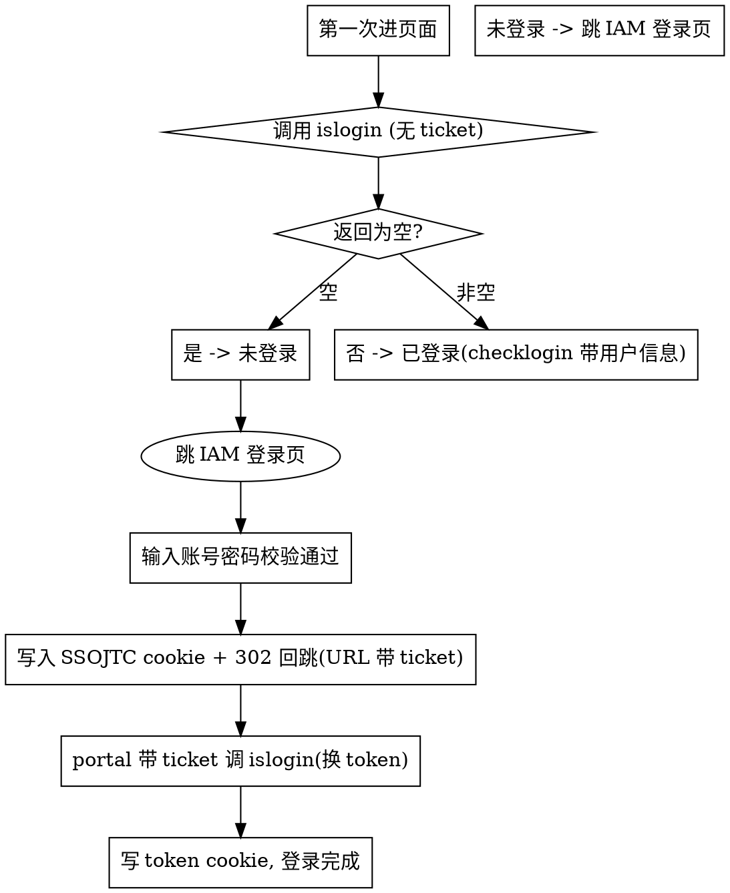

# 华为云登录 (Huawei Cloud Login)

## Overview

程序化实现华为云平台（Huawei Cloud）的登录/登出全流程。核心是基于
**Cookie/Session 会话**的纯 HTTP 请求，而非浏览器自动化。登录状态由浏览会话中
持久化的 **token Cookie** 判定：有 token 即已登录，无 token / islogin 返回空即未登录。

**一句话流程**：`islogin 判断登录态` → `跳转 IAM 登录页输入账号密码` → `IAM 校验通过写入
SSOJTC cookie 并 302 回跳带上 ticket` → `portal 拿 ticket 调 islogin 换 token` → `写入
token cookie 完成登录`。

## When to Use

触发场景：

- 需要程序化登录/登出华为云平台
- 需要先判断当前 session 是否已登录（islogin）
- 需要完成 IAM SSO 登录 + ticket 换 token 的完整流程
- 需要管理 SSOJTC / token 相关 cookie

**不用**此 skill 的场景：

- 需要真实浏览器渲染/交互（JS 重定向复杂页面）→ 用 Playwright/Selenium（见 Common
  Mistakes）
- 使用华为云 AK/SK 或 IAM 用户完成 API 调用认证（那是
  `huawei-cloud-functiongraph-function-create` 里的 SDK 认证，不是本 SSO 流程）

## Login State Machine



## Quick Reference

| 步骤 | 动作 | 关键点 |
|------|------|--------|
| 1. 判断登录态 | `GET islogin`（无 ticket） | 返回空 = 未登录；返回 `checklogin({...})` = 已登录 |
| 2. 跳转登录 | 302 到 IAM 登录页 | `service`=回调地址，`locale`=语言参数 |
| 3. 账号密码校验 | IAM 校验 | 通过则写 **SSOJTC** cookie，302 回跳 |
| 4. 换 token | `GET islogin?ticket=ST-xxx` | portal 拿 ticket 换 token |
| 5. 完成登录 | 写 **token** cookie | 登录成功 |
| 6. 退出登录 | `GET /authui/logout?service=回调` | 删除 token cookie |

## Implementation

### 1. 环境与会话

纯 HTTP + Cookie/Session，用会话保持 cookie：

```python
import requests

session = requests.Session()          # 会话自动持久化 cookie
session.headers.update({"User-Agent": "Mozilla/5.0 (..."})
```

### 2. 判断登录态（GET islogin）

首次进入页面，调用 DGW 的 islogin 接口判断是否登录：

- **无 ticket 参数**：仅探测登录态
- 注意：`https://devdata2.huaweicloud.com/index/islogin` 为**暂定地址**，实际以部署为准

```python
resp = session.get(ISLOGIN_URL)          # 无 ticket
text = resp.text.strip()

if not text:
    # 未登录：text 为空
    print("未登录")
else:
    # 已登录：形如 checklogin({username:xxx,imager_url:xxx,domainId:xxx,userId:xxx})
    print("已登录:", text)
```

**返回格式约定**（已登录）：

```
checklogin({username:xxx,imager_url:xxx,domainId:xxx,userId:xxx})
```

- 可从响应中解析 `username`、`imager_url`（头像）、`domainId`、`userId`
- 返回**为空字符串**即为未登录

### 3. 跳转 IAM 登录页

登录按钮触发跳转，进入 IAM 统一认证页：

```
https://auth.huaweicloud.com/authui/login.html?service=<回调地址>&locale=zh-cn#/login
```

| 参数 | 说明 | 示例 |
|------|------|------|
| 登录页面地址 | 固定 | `https://auth.huaweicloud.com/authui/login.html` |
| `service` | 登录成功后的回调地址 | `https://developer.huaweicloud.com/`（需 URL 编码） |
| `locale` | 语言参数 | `zh-cn`、`en-us` 等 |

### 4. IAM 校验通过 → 写 cookie 回跳

IAM 登录页是**第三方页面**，脚本不介入、也不处理该页面的表单提交。账号密码的输入与
认证、以及 SSOJTC cookie 的写入，全部由 IAM 页面在其自身会话中完成。脚本在构造好
跳转 URL（步骤 3）后，剩下的认证由用户/浏览器在 IAM 完成，脚本只等待/感知其结果。

IAM 校验通过后，IAM 侧发生的事（脚本无需代码，仅理解其行为以对接后续步骤）：

1. 写入 **SSOJTC** cookie（IAM 会话标识）
2. HTTP **302** 重定向回原页面（即 `service` 回调地址）
3. 回跳 URL 中带上了 **ticket**（如 `ST-8223-uVdcwFf6gEnFi34p1RR7OJ0o-sso`）

脚本需要做的是：捕获回跳到 portal 时的 **ticket**，用于下一步换 token。当流程为纯
HTTP 驱动、由脚本跟进 `Location` 重定向时，可从 302 回跳 URL 中解析：

```python
# 仅当脚本跟随 IAM 302 回跳时才需要解析；浏览器场景下从页面 URL 读取
from urllib.parse import urlparse, parse_qs
ticket = parse_qs(urlparse(ticket_url).query)["ticket"][0]
```

**关键点**：一次性 ticket，回跳 URL 上以查询参数形式传递；ticket 的产生与 SSOJTC
cookie 均由 IAM 第三方页完成，脚本不重复实现。

### 5. ticket 换 token（GET islogin + ticket）

portal 拿到 ticket 后，带 ticket 再次调用 DGW 的 islogin 接口，完成 **ticket 换 token**
并带回登录信息：

```
GET https://devdata2.huaweicloud.com/index/islogin?ticket=ST-8223-uVdcwFf6gEnFi34p1RR7OJ0o-sso
```

```python
resp = session.get(ISLOGIN_URL, params={"ticket": ticket})
# 响应带回登录信息（同第 2 步的 checklogin 格式）
```

完成这一步后，**写入 token cookie**，登录成功。

### 6. 退出登录

登出调用 GET 请求，并带 `service`（回调地址）参数：

```
GET https://auth.ulanqab.huawei.com/authui/logout?service=<回调地址>
```

此操作会**删除 cookie 中的 token**，完成退出。之后再次调用 islogin 应返回空（未登录）。

```python
session.get(LOGOUT_URL, params={"service": CALLBACK_URL})
session.cookies.clear()          # 会话内再清空一次，确保状态干净
```

## Config Placeholder

**接口地址均为参数/常量，按实际部署替换**（注意 `devdata2` 路径为暂定）：

```python
ISLOGIN_URL  = "https://devdata2.huaweicloud.com/index/islogin"      # 暂定
LOGIN_URL    = "https://auth.huaweicloud.com/authui/login.html"     # IAM 登录页
LOGOUT_URL   = "https://auth.ulanqab.huawei.com/authui/logout"      # 登出
CALLBACK_URL = "https://developer.huaweicloud.com"                  # service 回调
```

## Parameter Confirmation

| 参数 | 必/选 | 说明 | 示例 |
|------|-------|------|------|
| `ISLOGIN_URL` | 必 | DGW islogin 接口（**暂定占位**） | `https://devdata2.huaweicloud.com/index/islogin` |
| `service` / `callback` | 必 | 登录回调地址 | `https://developer.huaweicloud.com` |
| `locale` | 选 | 语言参数 | `zh-cn` |
| `LOGIN_URL` | 必 | IAM 登录页（**第三方**，脚本仅构造跳转 URL，不处理表单） | `https://auth.huaweicloud.com/authui/login.html` |
| `LOGOUT_URL` | 必 | 登出接口 | `https://auth.ulanqab.huawei.com/authui/logout` |

> 账号（`username`）与密码（`password`）的输入/认证全部发生在 **IAM 第三方页面**，
> 不是本流程的脚本参数，脚本不提交也不处理登录表单。

## Common Mistakes

| 误区 | 正确做法 |
|------|----------|
| 用浏览器自动化/JS 执行做全流程 | 本流程可纯 HTTP 完成；仅当目标站有复杂 JS 渲染/重定向才需 Playwright/Selenium |
| 换 token 时复用旧 ticket | ticket 是**一次性**的，每次登录必须重新走流程拿新 ticket |
| 判断登录只看返回非空 | 需确认返回符合 `checklogin({...})` 格式；空串 = 未登录 |
| 忽略 302 回跳 URL 中的 ticket | ticket 在 `Location` 的 query 上，须解析后用于步骤 5 |
| cookie 不持久化 | 必须用会话对象（`requests.Session`/axios 带 cookie jar），否则 token 不会保持 |
| 退出登录后不清 cookie jar | 登出后 `session.cookies.clear()` 确保状态干净 |
| 尝试接管/转发 IAM 登录页表单提交 | IAM 是**第三方页面**，脚本只构造跳转 URL，账号密码的输入、校验、写 SSOJTC 均由 IAM 页完成，脚本不介入 |

## Best Practices

1. **会话复用**：用 `Session`/cookie jar 贯穿 islogin→登录→换 token 全流程
2. **ticket 一次性**：每次登录独立产生新 ticket，勿缓存复用
3. **security**：URL 参数避免明文传递敏感信息；脚本自身不处理账号密码（交由 IAM 第三方页），故无密码可落日志
4. **探测与业务分离**：进页面先 islogin 判断，不必每次强制走完整登录
5. **登出收尾**：调 logout + 清 cookie jar，保证二次登录状态正确